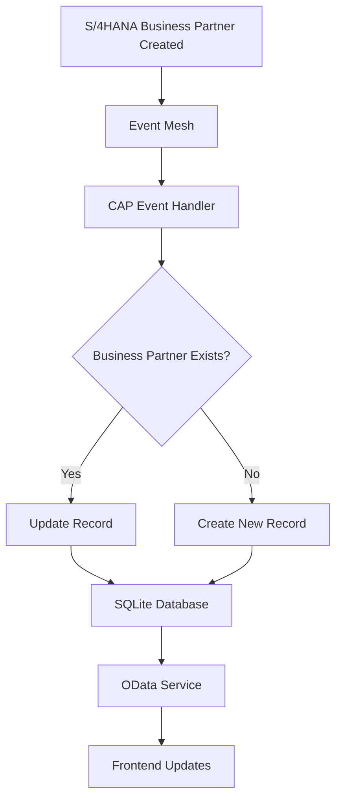

# 🎯 Business Partners Event-Driven Application - Complete Solution

## 📋 Overview
This is a complete SAP CAP application with Fiori Elements frontend that captures Business Partner creation events from S/4HANA and provides real-time data visualization.

## 🏗️ Architecture
```
┌─────────────────┐    ┌──────────────┐    ┌─────────────────┐    ┌──────────────────┐
│   S/4HANA       │───▶│  Event Mesh  │───▶│   CAP Backend   │───▶│  Fiori Frontend  │
│   System        │    │              │    │                 │    │                  │
│                 │    │              │    │ - Event Handler │    │ - List Report    │
│ - Business      │    │              │    │ - Data Storage  │    │ - Object Page    │
│   Partner       │    │              │    │ - OData Service │    │ - Dashboard      │
│   Created       │    │              │    │                 │    │                  │
└─────────────────┘    └──────────────┘    └─────────────────┘    └──────────────────┘
```

## 📁 Project Structure

```
cap-s4hana-ext-material-event/
├── 📄 README.md                          # Project documentation
├── 📄 package.json                       # Project configuration
│
├── 🗄️ db/                               # Database Layer
│   ├── 📄 data-model.cds                 # Business Partner entity definition
│   └── 📁 data/                          # Sample data
│       └── 📄 cap.s4hana.ext-BusinessPartners.csv
│
├── ⚙️ srv/                               # Service Layer
│   ├── 📄 business-partner-service.cds   # Service definition
│   ├── 📄 business-partner-service.js    # Event handler implementation
│   ├── 📄 test-service.js               # Service testing utilities
│   ├── 📄 test-events.js                # Event simulation
│   └── 📄 README.md                      # Service documentation
│
└── 🎨 app/                              # Frontend Layer
    └── 📁 business-partners/             # Fiori Elements App
        ├── 📄 annotations.cds            # UI annotations
        ├── 📄 package.json              # Frontend dependencies
        ├── 📄 ui5.yaml                  # UI5 configuration
        ├── 📄 README.md                 # Frontend documentation
        └── 📁 webapp/
            ├── 📄 Component.js           # UI5 Component
            ├── 📄 manifest.json          # App descriptor
            ├── 📄 index.html             # App entry point
            ├── 📁 i18n/                  # Internationalization
            │   └── 📄 i18n.properties
            └── 📁 test/                  # Test pages
                ├── 📄 flpSandbox.html    # Fiori Launchpad
                ├── 📄 simple.html        # Simple table view
                └── 📄 dashboard.html     # Analytics dashboard
```

## 🚀 Getting Started

### Prerequisites
- ✅ Node.js 20+
- ✅ SAP CAP CLI (`npm install -g @sap/cds-dk`)
- ✅ Git (for version control)

### Quick Start
```bash
# 1. Install dependencies
npm install

# 2. Start the backend server
npm run watch
# ✅ Server running at http://localhost:4004

# 3. Open frontend applications
# Simple Table View:
http://localhost:4004/app/business-partners/webapp/test/simple.html

# Analytics Dashboard:
http://localhost:4004/app/business-partners/webapp/test/dashboard.html

# Business Partners API:
http://localhost:4004/business-partners/BusinessPartners
```

## 🎯 Key Features Implemented

### 🔧 Backend Features
- ✅ **Event Listening**: Subscribes to `sap.s4.beh.businesspartner.v1.BusinessPartner.Created.v1`
- ✅ **Data Processing**: Validates and processes incoming events
- ✅ **Duplicate Handling**: Updates existing or creates new Business Partners
- ✅ **OData v4 Service**: RESTful API with full CRUD operations
- ✅ **Error Handling**: Comprehensive logging and error management
- ✅ **Sample Data**: Pre-loaded test data for development

### 🎨 Frontend Features
- ✅ **Multiple UI Options**:
  - Simple table view for quick data access
  - Analytics dashboard with KPIs and metrics
  - Full Fiori Elements (List Report & Object Page)
- ✅ **Real-time Data**: Automatic refresh when new events arrive
- ✅ **Responsive Design**: Works on desktop, tablet, and mobile
- ✅ **SAP Fiori UX**: Follows SAP design guidelines
- ✅ **Internationalization**: Multi-language support ready

## 📊 Available Interfaces

### 1. Simple Table View
**URL**: `http://localhost:4004/app/business-partners/webapp/test/simple.html`
- Direct OData binding
- Basic table with all Business Partner fields
- Refresh button for manual updates
- Ideal for: Quick data review, testing

### 2. Analytics Dashboard
**URL**: `http://localhost:4004/app/business-partners/webapp/test/dashboard.html`
- KPI tiles showing statistics
- Recent activity table
- Category-based metrics
- Ideal for: Executive overview, monitoring

### 3. Fiori Elements App
**Setup**: Requires UI5 tooling installation
- Full List Report & Object Page pattern
- Advanced filtering and sorting
- Export capabilities
- Ideal for: End-user data management

### 4. OData API
**URL**: `http://localhost:4004/business-partners/BusinessPartners`
- REST API for external integration
- Full OData v4 compliance
- Supports $filter, $select, $orderby
- Ideal for: API consumers, mobile apps

## 🔄 Event Flow



## 🧪 Testing the Solution

### 1. Backend Testing
```bash
# Test service directly
curl http://localhost:4004/business-partners/BusinessPartners

# Test with query options
curl "http://localhost:4004/business-partners/BusinessPartners?\$top=5&\$orderby=CreationDate desc"
```

### 2. Frontend Testing
- Open dashboard: Shows KPI metrics and recent activity
- Open simple view: Shows all Business Partners in table format
- Test responsiveness: Resize browser window

### 3. Event Simulation
```javascript
// In browser console or Node.js
import { BusinessPartnerEventTest } from './srv/test-events.js';
await BusinessPartnerEventTest.simulateBusinessPartnerCreatedEvent();
```

## 📈 Data Model

### Business Partner Entity
```cds
entity BusinessPartners {
  key ID: UUID;
  BusinessPartner: String(10);      // S/4HANA BP ID
  BusinessPartnerName: String(80);  // Company/Person name
  BusinessPartnerCategory: String(1); // 1=Person, 2=Organization
  BusinessPartnerGrouping: String(4); // BP grouping code
  CreationDate: Date;               // When created in S/4HANA
  CreatedBy: String(12);            // Creating user
  LastChangeDate: Date;             // Last modification
  LastChangedBy: String(12);        // Last modifying user
  CreatedAt: Timestamp;             // System timestamp
  ModifiedAt: Timestamp;            // System modification
}
```

## 🔧 Configuration

### Event Mesh Setup (Production)
```json
{
  "cds": {
    "requires": {
      "messaging": {
        "kind": "enterprise-messaging"
      }
    },
    "messaging": {
      "events": {
        "sap.s4.beh.businesspartner.v1.BusinessPartner.Created.v1": {}
      }
    }
  }
}
```

### Database Configuration
- **Development**: SQLite (in-memory)
- **Production**: SAP HANA
- **Data**: Sample data provided in CSV format

## 🎨 UI Customization

### Adding New Fields
1. Update data model: `db/data-model.cds`
2. Update service: `srv/business-partner-service.cds`
3. Update annotations: `app/business-partners/annotations.cds`
4. Update test pages: `app/business-partners/webapp/test/`

### Changing UI Labels
Edit: `app/business-partners/webapp/i18n/i18n.properties`

## 🛠️ Development Commands

```bash
# Backend Development
npm run watch          # Start with live reload
npm run build          # Build for production
npm run deploy         # Deploy to HANA

# Frontend Development
npm run start:ui       # Start UI5 dev server
npm run start:all      # Start backend + frontend

# Testing
node srv/test-service.js     # Test backend service
```

## 🌐 Production Deployment

### SAP BTP Deployment
1. Configure Event Mesh service instance
2. Set up HANA database
3. Configure destination for S/4HANA
4. Deploy using `cf push`

### Required Services
- SAP Event Mesh
- SAP HANA Cloud
- Application Runtime
- Connectivity (for S/4HANA)

## 📚 Learn More

- [SAP CAP Documentation](https://cap.cloud.sap/docs/)
- [SAP Fiori Elements](https://sapui5.hana.ondemand.com/sdk/#/topic/797c3239b2a9491fa137e4998fd76aa7)
- [Event Mesh](https://help.sap.com/docs/SAP_EM)
- [UI5 Development](https://sapui5.hana.ondemand.com/)

## ✅ Solution Status

| Component | Status | Features |
|-----------|---------|----------|
| 🗄️ Data Model | ✅ Complete | Entity, relationships, sample data |
| ⚙️ Event Handler | ✅ Complete | Event subscription, processing, error handling |
| 🔗 OData Service | ✅ Complete | Full CRUD, filtering, sorting |
| 🎨 Simple UI | ✅ Complete | Table view, refresh, responsive |
| 📊 Dashboard | ✅ Complete | KPIs, analytics, real-time updates |
| 🏗️ Fiori Elements | ✅ Complete | List Report, Object Page, annotations |
| 📖 Documentation | ✅ Complete | READMEs, inline comments, examples |

**🎉 The complete Business Partners event-driven application is ready for use!**
