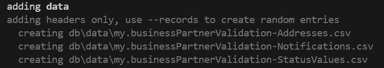
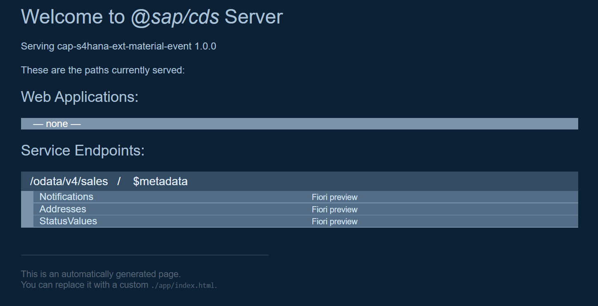

# Creating Basic Service

## Start a new project

```shell
npm i -g @sap/cds-dk
```

```shell
cds init cap-s4hana-ext-material-event
```

```shell
cd cap-s4hana-ext-material-event
```

## Create database layer

Create a new file `db/schema.cds` and define the CDS entities.

```cds
namespace my.businessPartnerValidation;

using {
  managed,
  cuid
} from '@sap/cds/common';

entity Notifications : managed, cuid {
  businessPartnerId   : String;
  businessPartnerName : String;
  verificationStatus  : Association to StatusValues;
  addresses           : Composition of many Addresses
                          on addresses.notifications = $self;
}

entity Addresses : cuid {
  notifications     : Association to Notifications;
  addressId         : String;
  country           : String;
  cityName          : String;
  streetName        : String;
  postalCode        : String;
  isModified        : Boolean default false;
  businessPartnerId : String;
}

@cds.autoexpose
entity StatusValues {
  key code        : String;
      value       : String;
      criticality : Integer;
      updateCode  : Boolean;
}

annotate Notifications with {
  businessPartnerId  @title: 'BusinessPartner ID'  @readonly;
  verificationStatus @title: 'Verfication Status';
}
```

## Create OData layer

Create a new file `srv/service.cds` and define the OData service.

```cds
using my.businessPartnerValidation as my from '../db/schema';

namespace service.businessPartnerValidation;

service SalesService @(requires: 'authenticated-user') {
  @odata.draft.enabled
  entity Notifications as projection on my.Notifications;

  entity Addresses     as projection on my.Addresses;

  event BusinessPartnerVerified {
    businessPartner     : String;
    businessPartnerName : String;
    verificationStatus  : String;
    addressId           : String;
    streetName          : String;
    postalCode          : String;
    country             : String;
    addressModified     : String;
  }
}
```

## Providing Initial Data

You can use CSV files to fill your database with initial data. The filenames are expected to match fully qualified names of respective entity definitions in your CDS models, optionally using a dash `-` instead of a dot `.` for cosmetic reasons. The content of these files is standard CSV content with the column titles corresponding to declared element names.


Run this to generate an initial set of empty `.csv` files with header lines based on your CDS model:

```shell
cds add data
```



CSV files can be found in the folders `db/data` and `test/data`, as well as in any data folder next to your CDS model files. When you use `cds watch` or `cds deploy`, CSV files are loaded by default from `test/data`. However, when preparing for production deployments using `cds build`, CSV files from `test/data` are not loaded.

That said, the files `db\data\my.businessPartnerValidation-Addresses.csv` and `db\data\my.businessPartnerValidation-Notifications.csv` should be test only. So, let's move them to a new location: `test/data`.

Now, let's populate these files with initial data.

File `db/data/my.businessPartnerValidation-StatusValues.csv`

```csv
code;value;criticality;updateCode
N;NEW;3;false
P;IN PROCESS;2;false
INV;INVALID;1;false
V;VERIFIED;4;true
C;COMPLETED;5;true
```

File `test/data/my.businessPartnerValidation-Addresses.csv`

```csv
ID;addressId;country;cityName;streetName;postalCode;notifications_ID;businessPartnerId
58040e66-1dcd-4ffb-ab10-fdce32028b79;"124462";"DE";"Walldorf";"Dietmar-Hopp-Allee 162";"560066";2c728381-72ce-4fdd-8293-8add71579666;17100001
64e718c9-ff99-47f1-8ca3-950c850777d4;"124463";"DE";"Walldorf";"some street";"123456";ff0bc005-710c-4097-a687-64ef380498f4;17100002
64e718c9-ff99-47f1-8ca3-950c850777e5;"124464";"DE";"Walldorf";"some street";"123456";16f00c9c-323f-4ce4-876f-efaefe1c6f69;17100003
```

File `test/data/my.businessPartnerValidation-Notifications.csv`

```csv
ID;businessPartnerId;businessPartnerName;verificationStatus_code
2c728381-72ce-4fdd-8293-8add71579666;17100001;TestData1;N
ff0bc005-710c-4097-a687-64ef380498f4;17100002;TestData2;P
16f00c9c-323f-4ce4-876f-efaefe1c6f69;17100003;TestData3;P
```

## Running the application locally

```shell
cds watch
```


