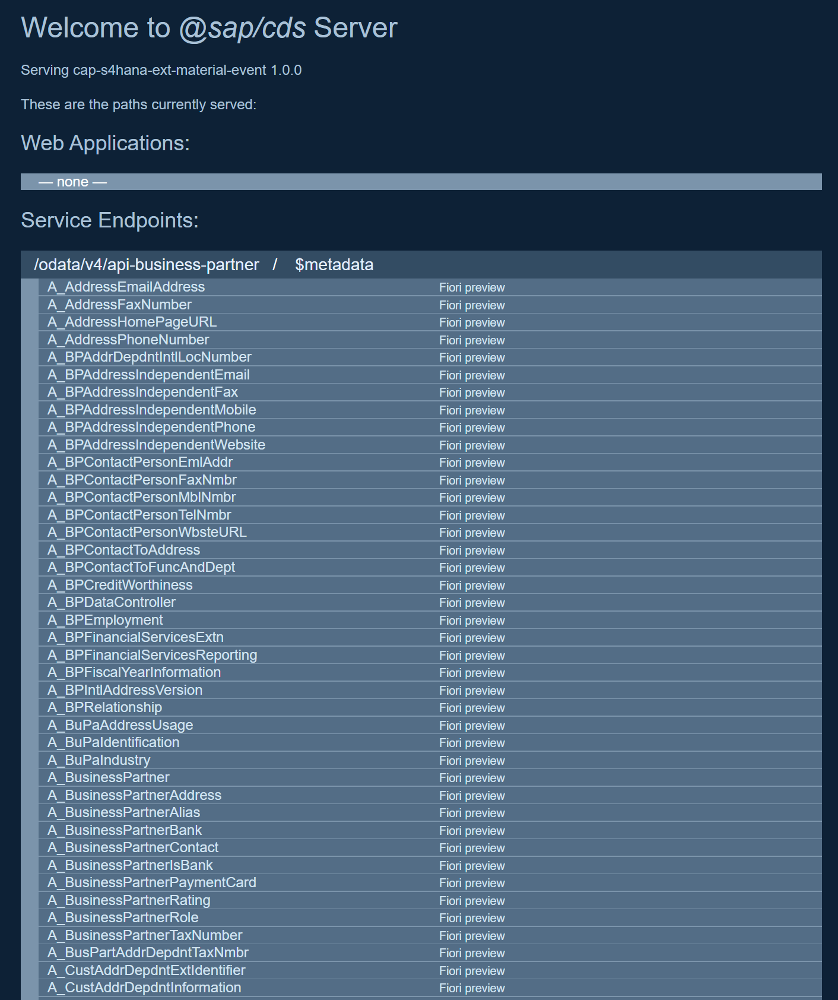
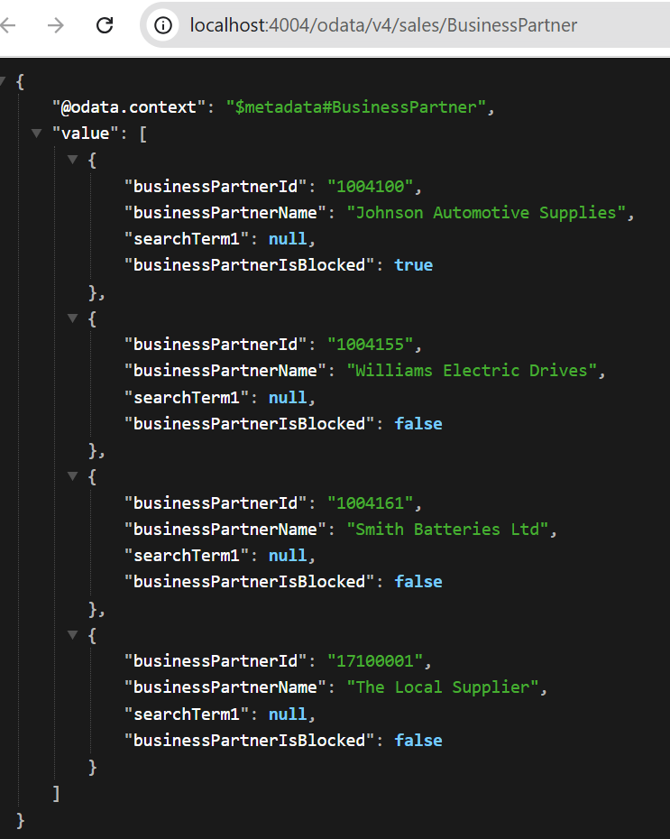

# Consuming Remote Service

## From SAP Business Accelerator Hub

The [SAP Business Accelerator Hub](https://api.sap.com/) provides many relevant APIs from SAP. You can download API specifications in different formats. If available, use the EDMX format. The EDMX format describes OData interfaces.

To download the [Business Partner API (A2X) from SAP S/4HANA Cloud](https://api.sap.com/api/API_BUSINESS_PARTNER/overview), go to section `API Resources`, select `API Specification`, and download the `EDMX file`.

Business Partner (A2X)
https://api.sap.com/api/API_BUSINESS_PARTNER/overview

Business Partner Events
https://api.sap.com/event/CE_BUSINESSPARTNEREVENTS/overview

##Import API Definition

Import the API to your project using cds import.

```shell
cds import API_BUSINESS_PARTNER.edmx --as cds
```

Install the new dependencies added to the project.

```shell
npm i
```

## Local Mocking

When developing your application, you can mock the remote service. 
As for any other CAP service, you can add mocking data.

The CSV file needs to be added to the `srv/external/data` folder.


File `API_BUSINESS_PARTNER-A_BusinessPartner.csv`

```csv
BusinessPartner;BusinessPartnerFullName;BusinessPartnerIsBlocked
1004155;Williams Electric Drives;false
1004161;Smith Batteries Ltd;false
1004100;Johnson Automotive Supplies;true
17100001;The Local Supplier;false
```

File `API_BUSINESS_PARTNER-A_BusinessPartnerAddress.csv`

```csv
BusinessPartner,AddressID,StreetName,CityName,Country,postalCode
"17100001","124462","Dietmar-Hopp-Allee 162","Walldorf","DE","12345"
"17100005","124465","whitefield 162","Bangalore","IN","560066"
```

## Expose Remote Service

To expose a remote service entity, you add a projection on it to your CAP service:

```cds
...
 @readonly
  entity BusinessPartnerAddress as
    projection on BUPA_API.A_BusinessPartnerAddress {
      key BusinessPartner as businessPartnerId,
          AddressID       as addressId,
          Country         as country,
          CityName        as cityName,
          StreetName      as streetName,
          PostalCode      as postalCode
    };

  @readonly
  entity BusinessPartner        as
    projection on BUPA_API.A_BusinessPartner {
      key BusinessPartner          as businessPartnerId,
          BusinessPartnerFullName  as businessPartnerName,
          SearchTerm1              as searchTerm1,
          BusinessPartnerIsBlocked as businessPartnerIsBlocked
    };
...
```

CAP automatically tries to delegate queries to database entities, which don't exist as you're pointing to an external service. That behavior would produce an error like this:

To avoid this error, you need to handle projections. Write a handler function to delegate a query to the remote service and run the incoming query on the external service.

Create a new srv/service.js to handle the OData Service.

```js
const cds = require("@sap/cds");

class SalesService extends cds.ApplicationService {
  async init() {
    const srv = this;
    const { BusinessPartner, BusinessPartnerAddress } = srv.entities;
    const bupaSrv = await cds.connect.to("API_BUSINESS_PARTNER");

    srv.on("READ", BusinessPartnerAddress, (req) => bupaSrv.run(req.query));
    srv.on("READ", BusinessPartner, (req) => bupaSrv.run(req.query));

    await super.init();
  }
}

module.exports = SalesService;
```

## Mock Remote Service as OData Service

Start the CAP application with the mocked remote service:

```shell
cds watch
```

You should see the Remote Service and its data coming through.






#### Mock Remote Service as OData Service

Start the CAP application with the mocked remote service:

```shell
cds mock API_BUSINESS_PARTNER
```

If the startup is completed, run cds watch in the same project from a different terminal:

```shell
cds watch
```

You should see the Remote Service.


#### Request failed with status code 404

If you see the following error, it means the application is trying to connect to the wrong `remote service endpoint`.

```json
{
  "error": {
    "message": "Error during request to remote service: Request failed with status code 404",
    "code": "502",
    "@Common.numericSeverity": 4
  }
}
```

Check the console logs, stop all the instances and force the remote service to run on the expected port. For instance:

```shell
cds mock API_BUSINESS_PARTNER --port 59524
```

Then, run `cds watch` again.