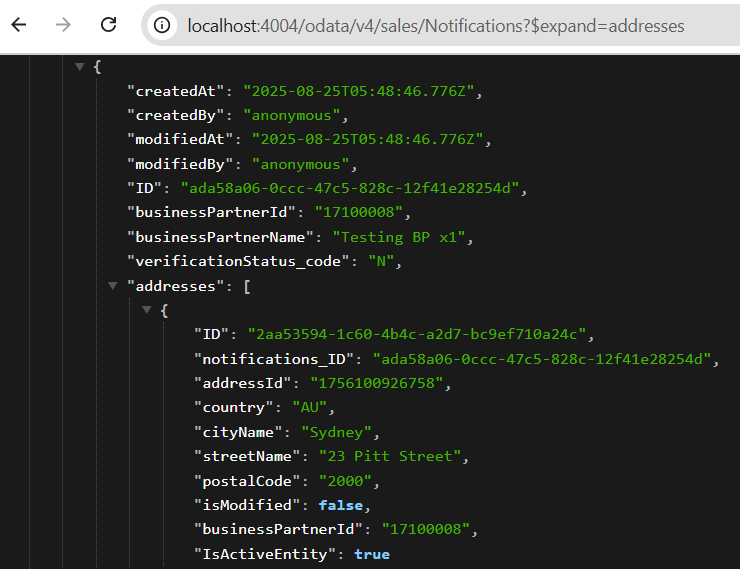

# Events and Messaging

## Add messaging feature to the project

There are many message brokers for different purposes, you can check them in the [Message Brokers documentation](https://cap.cloud.sap/docs/node.js/messaging#message-brokers). In this workshop, without a real remote backend system, we'll add the `local-messaging` for local testing only.

On a terminal, execute:

```shell
cds add local-messaging
```

A new entry will be added to the CDS configuration in the `package.json` file:

```json
  "cds": {
    "requires": {
      ...
      "messaging": {
        "kind": "local-messaging"
      }
    }
  }
```

## Find Information About Events

For example, using [SAP Business Accelerator Hub](https://api.sap.com/):

- Find the [BusinessPartner Events page](https://api.sap.com/event/SAPS4HANABusinessEvents_BusinessPartnerEvents/overview).
- Choose `View Event Reference`.
- Expand the `POST` request shown.
- Choose `Schema` tab.
- Expand the `data` property.

## Add Missing Event Declarations

In contrast to CAP, the asynchronous APIs of `SAP S/4HANA` are separate from synchronous APIs (that is, OData, REST). On CAP side, you need to fill this gap. For example, for an already imported `SAP S/4HANA BusinessPartner API`:

```cds
// Filling in missing events as found on SAP Business Accelerator Hub
using { API_BUSINESS_PARTNER as BUPA_S4 } from './API_BUSINESS_PARTNER';
extend service BUPA_S4 with {
  event BusinessPartner.Created @(topic:'sap.s4.beh.businesspartner.v1.BusinessPartner.Created.v1') {
    BusinessPartner : String
  }
  event BusinessPartner.Changed @(topic:'sap.s4.beh.businesspartner.v1.BusinessPartner.Changed.v1') {
    BusinessPartner : String
  }
}
```

## Consume Events Agnostically

With agnostic consumption, you can easily receive events from anywhere.

Edit the `srv/service.js` file to include the event/messaging handler. This code will listen to `Business Partner events` coming from `SAP S/4HANA`. Based on that, it'll populate the `Notifications` and `Addressess` tables defined in the project.

```js
    this.after("UPDATE", Notifications, (data) => {
      if (
        data.verificationStatus_code === "V" ||
        data.verificationStatus_code === "INV"
      )
        await messaging.emit("BusinessPartnerVerified", data);
    });

    const messaging = await cds.connect.to("messaging");
    messaging.on(
      "sap.s4.beh.businesspartner.v1.BusinessPartner.Created.v1",
      async (msg) => {
        logger.info("<< Create event caught", msg.data);
        const businessPartnerId = msg.data?.KEY[0]?.BUSINESSPARTNER;
        const bpQuery = bupaSrv.run(
          SELECT.one(BusinessPartner).where({
            businessPartnerId: businessPartnerId,
          })
        );
        const bpAddressQuery = bupaSrv.run(
          SELECT.one(BusinessPartnerAddress).where({
            businessPartnerId: businessPartnerId,
          })
        );
        // Not using Associations, sending two requests in parallel just to showcase this option
        const [businessPartner, address] = await Promise.all([bpQuery, bpAddressQuery]);
        await INSERT.into(Notifications).entries({
          businessPartnerId: businessPartnerId,
          verificationStatus_code: "N",
          businessPartnerName: businessPartner.businessPartnerName,
          addresses: [address],
        });
      }
    );

    // This is just to show that you can also emit events from CAP applications...
    messaging.on("BusinessPartnerVerified", (msg) => {
      logger.info("<< BP Verified event caught", msg.data);
    });
```

## Mocking events from SAP S/4HANA

As we don't have a real `SAP S/4HANA` system, let's create some code to pretend events are coming from there. Every time a `Business Partner` is created or changed, an event is triggered. This is exactly the same behavour as in a real system.

This is for `LOCAL TEST ONLY`! This should *NOT* exist when working and testing with a real remote backend service.

Create a new file `srv/external/API_BUSINESS_PARTNER.js`:

```js
const cds = require("@sap/cds");

// Mock events for S4, this is just for testing and pretending the events are coming from SAP S/4HANA
module.exports = async (srv) => {
  const logger = cds.log("remote-service-event");
  const { A_BusinessPartnerAddress } = srv.entities;
  const messaging = await cds.connect.to("messaging");
  srv.after("CREATE", async (data) => {
    await INSERT.into(A_BusinessPartnerAddress).entries({
      BusinessPartner: data.BusinessPartner,
      AddressID: Date.now(),
      Country: "AU",
      CityName: "Sydney",
      StreetName: "23 Pitt Street",
      PostalCode: "2000",
    });

    const payload = { KEY: [{ BUSINESSPARTNER: data.BusinessPartner }] };
    await messaging.emit(
      "sap.s4.beh.businesspartner.v1.BusinessPartner.Created.v1",
      payload
    );
    logger.info("<< BP Created event emitted", payload);
  });

  srv.after("UPDATE", async (data) => {
    const payload = { KEY: [{ BUSINESSPARTNER: data.BusinessPartner }] };
    await messaging.emit(
      "sap.s4.beh.businesspartner.v1.BusinessPartner.Changed.v1",
      payload
    );
    logger.info("<< BP Changed event emitted", payload);
  });
};
```

## Testing services and events

Create an `.http` file to send requests to your CAP service and to trigger events.

File `test/req.http`:

```http
### Create BP
POST http://localhost:4004/odata/v4/api-business-partner/A_BusinessPartner
Content-Type: application/json

{
  "BusinessPartner": "17100008",
  "BusinessPartnerFullName": "Testing BP x1",
  "BusinessPartnerIsBlocked": true,
  "Language": "EN"
}
### Edit BP
PATCH http://localhost:4004/odata/v4/api-business-partner/A_BusinessPartner('17100005')
Content-Type: application/json

{
    "BusinessPartnerIsBlocked": false
}
```

As expected, the BP will be created and the event will be triggered. Our CAP application wil react to that and populate the `Notifications` and `Addressess` tables.

