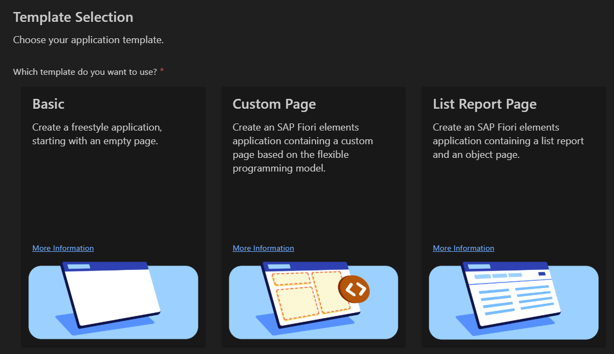
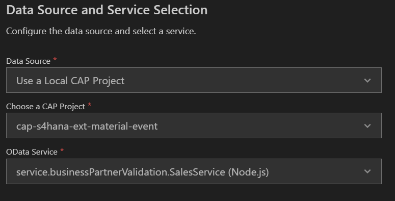
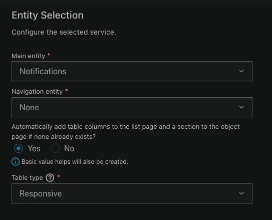
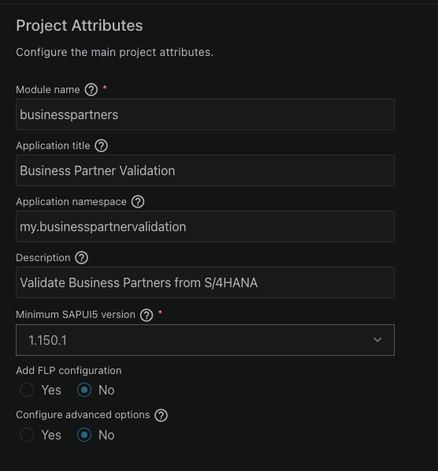

# SAP Fiori App

In this phase you add the user interface. Using SAP Fiori tools you will generate a Fiori Elements List Report application that displays the Notifications created by the event handler, allowing users to review and set verification statuses on Business Partners.

## Creating the frontend

The Fiori UI is generated using the **SAP Fiori tools Application Generator**. How you launch it depends on your environment:

- **SAP Business Application Studio (BAS)** — from the menu, go to `View` → `Command Palette`, then search for and run `Fiori: Open Application Generator`.
- **VS Code** — install the [SAP Fiori tools Extension Pack](https://marketplace.visualstudio.com/items?itemName=SAPSE.sap-ux-fiori-tools-extension-pack) if you haven't already, then open the Command Palette (`Cmd+Shift+P` / `Ctrl+Shift+P`) and run `Fiori: Open Application Generator`.

Once the generator opens, the UI is the same in both environments.

### Template Selection

Create a List Report Page:

Select List Report Page as the UI application template, and click Next.

### Data Source and Service Selection

### Entity Selection

Select `Notifications` as the main entity. This is the central record the validation workflow is built around — the List Report will display all Notifications, and clicking one will open an Object Page where the user can set the verification status.

### Project Attributes

Fill in the project attributes as follows:

| Field | Value |
|-------|-------|
| Module Name | `businesspartners` |
| App Title | `Business Partner Validation` |
| App Namespace | `my.businesspartnervalidation` |
| Description | `Validate Business Partners from S/4HANA` |
| SAPUI5 version | (leave as default) |
| Add FLP Config | No |
| Advanced options | No |

The module name is important — `businesspartners` matches the existing `app/businesspartners/` folder in the project. Using a different name will generate the app in the wrong location.

## Adding UI annotations

The generated app has no annotations yet — without them the List Report will display raw data with no field labels, filters, or column configuration. The annotations are defined in `app/ui-annotations.cds`.

Copy the following files from the workshop repository into your project:

- `app/ui-annotations.cds` → into your `app/` folder
- `app/businesspartners/webapp/manifest.json` → replacing the generated `manifest.json` in your `app/businesspartners/webapp/` folder

The `manifest.json` replacement is needed because the generated version is missing the Object Page route for the Address entity.

Once both files are in place, restart `cds watch`. The Fiori app will pick up the annotations automatically on next load.